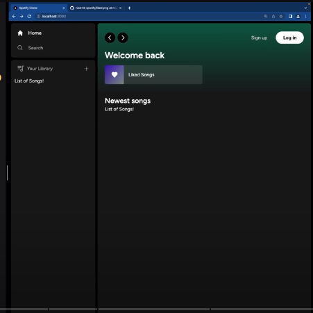

Clone the project

```bash
  git clone https://github.com/Imranul-hoque/spotify-clone.git
```

Go to the project directory

```bash
  cd my-project
```

Install dependencies

```bash
  npm install
```

Start the server

```bash
  npm run start
```


## Usage

1. Configure `supabase` for project like `database` `storage` And `auhentication`
2. Run the application: `npm start` (or `yarn start`).
3. Open the app in your web browser: `http://localhost:3000`.


## Folder Structure

**Actions** : This folder is concern for fetching data from supabse but That one is not denoting regular server action in next js

**Provider** : provider folder is only concern for application provider


## Contact

For questions or support, please contact [Your Name] at [imran.contuct@gmail.com].

# Hi, I'm Imranul Hoque! 👋


## 🛠 Tech
`Html` `Css` `Javascript` `Nextjs` `Tailwindcss` `Typescript` `Nodejs` `Nestjs` and related tech


## Music Platform



## Dynamic User Interface:
SoundWave boasts a modern and dynamic user interface designed for an immersive and enjoyable music discovery experience. Navigating through your favorite genres, artists, and playlists has never been smoother.

## Next.js Speed:
Leveraging the speed and efficiency of Next.js, SoundWave ensures lightning-fast load times and responsiveness. Enjoy uninterrupted music playback and seamless transitions between pages.

## Personalized Playlists:
 Tailor your music journey with personalized playlists curated just for you. Our sophisticated recommendation engine analyzes your listening habits to create playlists that match your unique taste.


## Artist Insights: 
Dive deeper into the world of your favorite artists. SoundWave provides exclusive insights, interviews, and behind-the-scenes content, giving you a richer understanding of the music you love.

## High-Quality Audio: 
Immerse yourself in crystal-clear, high-quality audio. SoundWave ensures that every beat and note is delivered with precision, providing an unparalleled listening experience.
